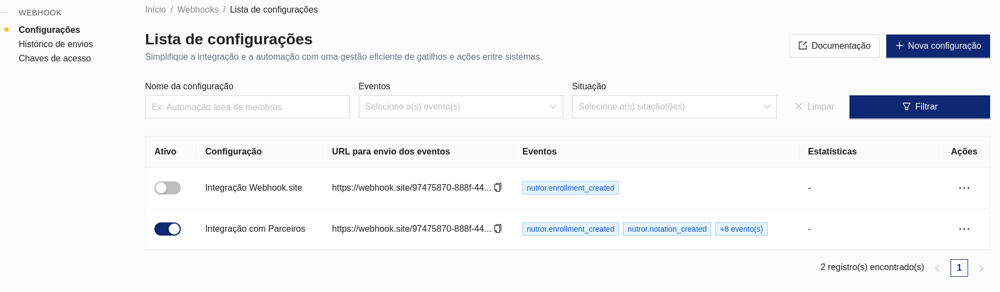
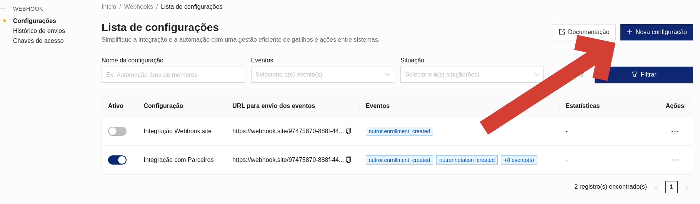
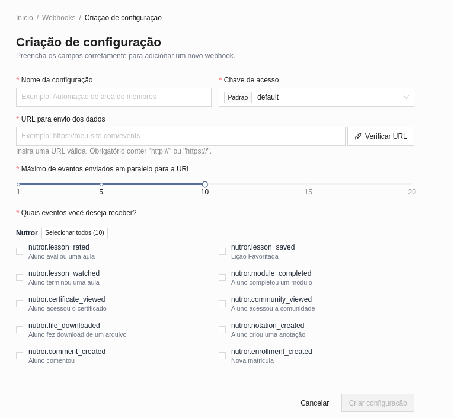
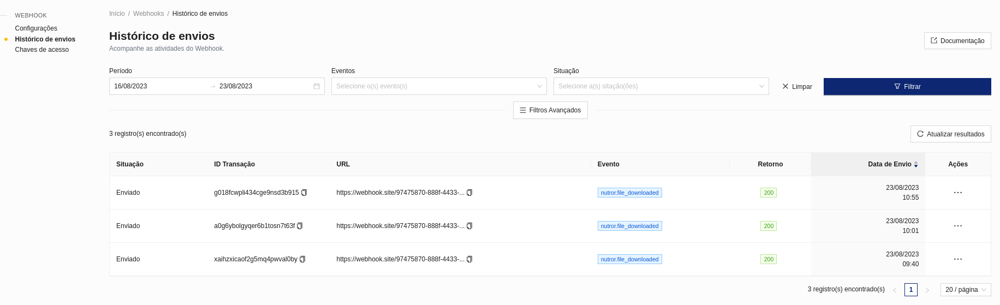
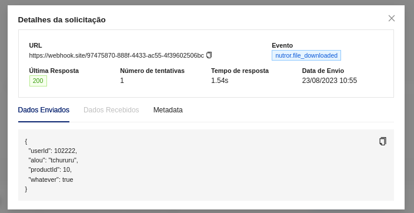
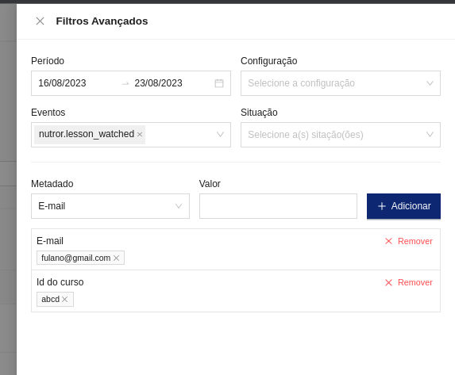
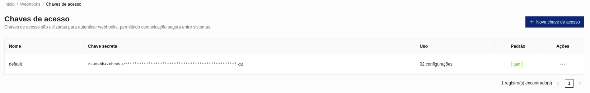

# Webhook Eduzz

O Webhook da Eduzz permite que você receba eventos de todas as aplicações da plataforma. Você pode configurar uma ou dezenas de integrações para que seu negócio consiga responder da melhor forma possível as suas espectativas


## Onde posso criar um webhook?

Para configurar uma nova integração, basta conferir o **[sistema de integra
cões da eduzz](https://integrations.eduzz.com)**.



## Criando uma nova configuração

Ná tela de configurações você encontra um botão para cadastrar suas integrações



Ao apertar este botão você vai para a tela de cadastro:



Os campos são os seguintes:

1. *Nome da Configuração*: Aqui você dá um nome que seja claro para descrever essa configuração
2. *Chave de acesso*: Nesse campo você seleciona a [secret](/secret) que será usado para assinar as mensagens enviadas para o seu sistema
3. *URL para envio dos dados*: URL onde será enviado os payloads. É importante que seja executado o teste para garantir que a URL está retornando um Status HTTP válido (200 - 299)
4. *Máximo de eventos enviados em paralelo para a URL*: A Eduzz é pioneira no envio controlado de webhooks para os parceiros. Em um grande lançamento pode acontecer da quantidade de envios tornar o seu sistema indisponível. Com essa configuração você consegue definir um limite de envios e garante que sua aplicação não vai cair devido ao auto volume. Pode ficar tranquilo que você vai receber todos os eventos.
5. *Quais eventos você deseja receber?*: Aqui você escolhe quais eventos você quer receber na sua URL
6. Pressione o botão *Criar Configuração* e veja ela criada na lista.

### Ativando uma configuração

Ao criar uma nova configuração, ela é criada com o status *disabled*. Ao clicar na ação de ativar, será enviado um evento de *ping* para ver se sua API responde corretamente. Caso ela responda sua configuração será ativada com sucesso.

## Histórico de Envios

Ao clicar no item de "Histórico de Envios" no menu, você será apresentado a uma tela com os últimos envios para o seu endpoint.

Na tabela você encontra alguns detalhes, como: Situação do Envio, ID do evento, URL que foi enviado, o evento e o último status de resposta



Se você clicar nos 3 pontinhos de um item, vai aparecer um menu onde você pode fazer o reenvio ou ver os detalhes do evento.



Na tela de detalhes você tem várias informações inportantes, como a data do envio, número de tentativas, payload enviado, resposta da sua API, os metadados e o tempo que sua API levou para responder esse evento.



A tela de histórico ainda tem vários filtros para te ajudar a encontrar um evento específico. Os filtros avançados oferecem ainda mais possiblidades, podendo filtrar eventos por metadados, situações, configurações específicas e eventos específicos. Tudo em multipla escolha para dar mais possibilidades

## Chaves de Acesso

Como os webhooks são enviados em URLs públicas pela internet, não tem como você evitar que alguem mal intencionado tente enviar um evento falso se passando pela Eduzz. Por isso a gente criou essa tela onde você consegue criar chaves para, assim, conseguir validar que o evento veio realmente da eduzz.



Quando a eduzz envia uma mensagem, ela gera uma assinatura baseada no conteúdo da mensagem e envia essa assinatura via cabeçalho HTTP. Como somente você e a eduzz conhecem essas chaves, você consegue recalcular essa assinatura e garantir que a mensagem é legitima


O cabeçalho x-signature é gerado a partir da seguinte função (disponível em todas as linguagens de programação):

```hmac('sha256`, secret, bodyDaRequest)```

Se o valor de retorno dessa função for identico ao que está no header x-signature, a mensagem recebida é legítima.

Você também pode cadastrar quantas chaves você quiser, isso permite que, caso você queira enviar webhooks para sistemas de terceiros, esses envios sejam feitos com chaves específicas e isso aumenta a sua segurança.