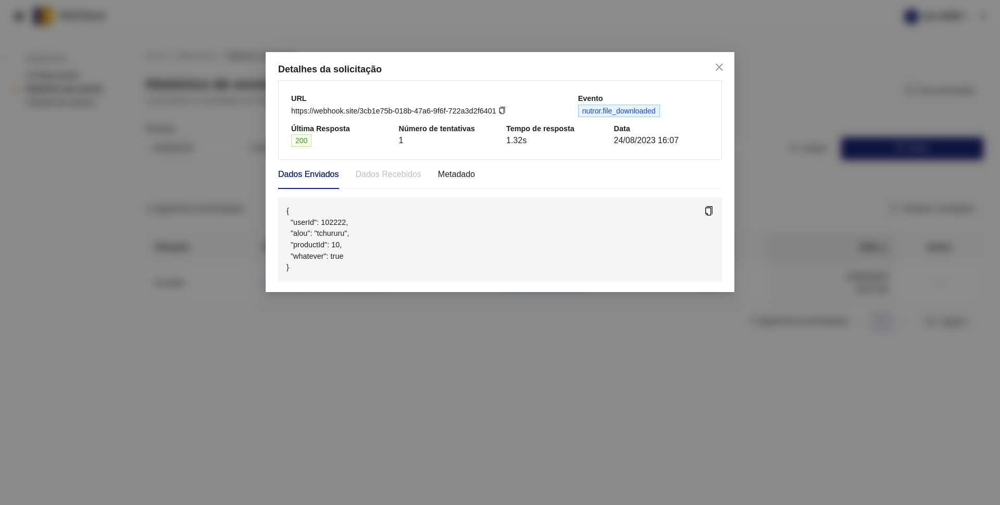

# Webhook Eduzz

O Webhook da Eduzz permite que você receba requisições **HTTP** em sua aplicação sempre que um novo evento acontecer em sua conta. Você pode configurar uma integração para receber diversos eventos de diversas aplicações diferentes da Eduzz: **https://integrations.eduzz.com/webhook/configs**.

## Eventos e payloads

O formato do json será sempre o seguinte:

```json
{
    "id": "z154l2pvk6jltotg0xy86glx" // id do evento,
    "event": "nutror.lesson_started" // nome do evento,
    "data": {}, // dados do evento,
    "sentDate": "2023-08-31T18:34:23.023Z" // data do evento
}
```

Os eventos disponíveis atualmente são os seguintes:

 - **Blinket**
    - **[attendance_added](./events/blinket/attendance_added.md)**
    - **[attendance_assigned](./events/blinket/attendance_assigned.md)**
    - **[attendance_canceled](./events/blinket/attendance_canceled.md)**
    - **[attendance_edited](./events/blinket/attendance_edited.md)**
    - **[attendances_printed](./events/blinket/attendances_printed.md)**
    - **[attendance_checkin](./events/blinket/attendance_checkin.md)**
    - **[attendance_tag_changed](./events/blinket/attendance_tag_changed.md)**
    - **[ticket_edited](./events/blinket/ticket_edited.md)**

 - **MyEduzz**
    - **[contract_created](./events/myeduzz/contract_created.md)**
    - **[contract_updated](./events/myeduzz/contract_updated.md)**
    - **[invoice_opened](./events/myeduzz/invoice_opened.md)**
    - **[invoice_paid](./events/myeduzz/invoice_paid.md)**
    - **[invoice_canceled](./events/myeduzz/invoice_canceled.md)**
    - **[invoice_waiting_refund](./events/myeduzz/invoice_waiting_refund.md)**
    - **[invoice_refunded](./events/myeduzz/invoice_refunded.md)**
    - **[invoice_expired](./events/myeduzz/invoice_expired.md)**
    - **[invoice_recovering](./events/myeduzz/invoice_recovering.md)**
    - **[invoice_waiting_payment](./events/myeduzz/invoice_waiting_payment.md)**
    - **[invoice_refused](./events/myeduzz/invoice_refused.md)**
    - **[invoice_overdue](./events/myeduzz/invoice_overdue.md)**
    - **[invoice_scheduled](./events/myeduzz/invoice_scheduled.md)**
    - **[invoice_negotiated](./events/myeduzz/invoice_negotiated.md)**
    - **[commission_processed](./events/myeduzz/commission_processed.md)**

 - **Nutror**
    - **[certificate_viewed](./events/nutror/certificate_viewed.md)**
    - **[comment_created](./events/nutror/comment_created.md)**
    - **[community_viewed](./events/nutror/community_viewed.md)**
    - **[enrollment_created](./events/nutror/enrollment_created.md)**
    - **[file_downloaded](./events/nutror/file_downloaded.md)**
    - **[inactive_student](./events/nutror/inactive_student.md)**
    - **[learner_help](./events/nutror/learner_help.md)**
    - **[lesson_rated](./events/nutror/lesson_rated.md)**
    - **[lesson_saved](./events/nutror/lesson_saved.md)**
    - **[lesson_started](./events/nutror/lesson_started.md)**
    - **[lesson_watched](./events/nutror/lesson_watched.md)**
    - **[module_completed](./events/nutror/module_completed.md)**
    - **[notation_created](./events/nutror/notation_created.md)**
 
 - **AlpaClass**
    - **[student_created](./events/alpaclass/student_created.md)** 
    - **[student_certificate_accessed](./events/alpaclass/student_certificate_accessed.md)** 
    - **[student_comment_created](./events/alpaclass/student_comment_created.md)** 
    - **[student_course_finished](./events/alpaclass/student_course_finished.md)** 
    - **[student_course_unfinished](./events/alpaclass/student_course_unfinished.md)** 
    - **[student_course_last_seen_at](./events/alpaclass/student_course_last_seen_at.md)** 
    - **[student_module_finished](./events/alpaclass/student_module_finished.md)** 
    - **[student_module_unfinished](./events/alpaclass/student_module_unfinished.md)** 
    - **[student_lesson_finished](./events/alpaclass/student_lesson_finished.md)** 
    - **[student_lesson_unfinished](./events/alpaclass/student_lesson_unfinished.md)** 
    - **[student_lesson_marked_as_favorite](./events/alpaclass/student_lesson_marked_as_favorite.md)** 
    - **[student_lesson_unmarked_as_favorite](./events/alpaclass/student_lesson_unmarked_as_favorite.md)** 
    - **[student_lesson_last_seen_at](./events/alpaclass/student_lesson_last_seen_at.md)** 

   

## Como configurar um webhook

Ao acessar o webhook, a seguinte tela de listagem de configurações será exibida:


Para cadastrar uma nova integração, basta acessar o **[formulário de cadastro](https://integrations.eduzz.com/webhook/new)** na tela de listagem de configurações clicando em **"+ Nova configuração"**, então, o seguinte formulário será exibido:


É possível para o usuário preencher os seguintes campos:

- **Nome da configuração:** Uma descrição para a sua configuração.

- **Chave de acesso:** Nesse campo, é possível escolher qual chave de autenticação será utilizada para assinar as mensagens que serão enviadas.

- **URL para envio dos dados:** URL para onde os dados serão enviados. É importante realizar um teste para garantir que a URL esteja retornando um status HTTP válido (códigos 200 a 299).

- **Máximo de eventos enviados em paralelo para a URL:** A Eduzz é pioneira no envio controlado de webhooks para os parceiros. Durante um grande lançamento, pode acontecer de a quantidade de envios tornar o seu sistema indisponível. Com essa configuração, você consegue definir um limite de envios e garante que sua aplicação não vai cair devido ao alto volume. Pode ficar tranquilo, você receberá todos os eventos.

- **Quais eventos você deseja receber?:** Você pode escolher quais eventos serão enviados para sua URL, de diversas aplicações.

**Segue exemplo de formulário preenchido:**


Não se esqueça de clicar em **"Verificar URL"** para testar se a url retorna status HTTP válido (códigos 200 a 299), caso contrário não será possível cadastrar sua configuração

Então, basta clicar em "Criar configuração" e sua configuração será salva com sucesso.


### Ativando uma url

Ao criar uma nova configuração, ela é criada com o status **desativado**. Ao clicar na ação de ativar, será enviado um evento falso de **ping**, apenas para verificar se sua API responde corretamente. Caso ela responda, sua configuração será ativada com sucesso.


### Histórico de Envios

Ao clicar no item "Histórico de Envios" no menu, você será direcionado a uma tela com os envios mais recentes para o seu endpoint.

Na tabela, você encontrará alguns detalhes, tais como: Situação do Envio, ID do evento, URL que foi enviada, o tipo de evento e o último status de resposta.


Clicando em ações no item da listagem, você poderá reenviar ou visualizar os detalhes do evento.



Na tela de detalhes, você encontrará várias informações importantes, como a data do envio, número de tentativas, payload enviado, resposta da sua API, os metadados e o tempo que sua API levou para responder a esse evento.


A tela de histórico também possui diversos filtros para auxiliar na busca por um evento específico. Os filtros avançados oferecem ainda mais possibilidades, permitindo filtrar eventos por metadados, situações, configurações específicas e eventos específicos. Tudo em múltipla escolha para proporcionar mais opções.

### Segurança

Como os webhooks são enviados para URLs públicas pela internet, não é possível evitar que alguém mal intencionado tente enviar um evento falso, fingindo ser da Eduzz. É por isso que criamos essa tela, onde você pode gerar chaves para validar se o evento realmente originou-se da Eduzz.


Quando a Eduzz envia uma mensagem, ela gera uma assinatura com base no conteúdo da mensagem e envia essa assinatura pelo cabeçalho HTTP. Como somente você e a Eduzz conhecem essas chaves, você pode recalcular essa assinatura e garantir a autenticidade da mensagem.


O cabeçalho x-signature é gerado usando a seguinte função (disponível em todas as linguagens de programação):

```hmac('sha256', chave_secreta, corpo_da_requisição)```

Se o valor resultante dessa função for idêntico ao valor no cabeçalho x-signature, a mensagem recebida é legítima.

Você também pode cadastrar quantas chaves desejar. Isso permite que, caso deseje enviar webhooks para sistemas de terceiros, esses envios sejam autenticados com chaves específicas, aumentando ainda mais a segurança.
